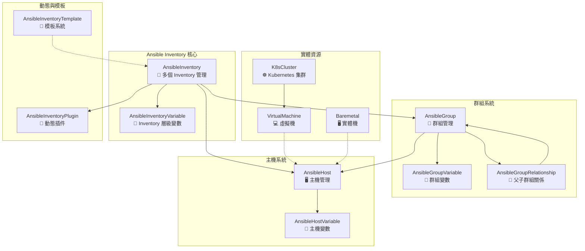
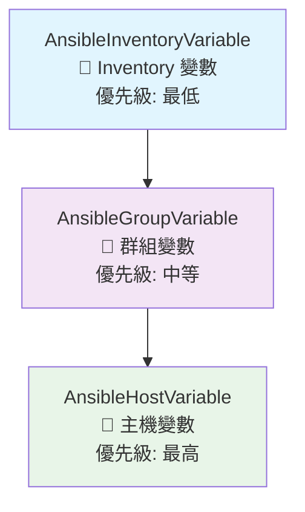
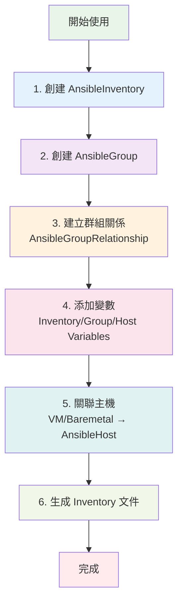
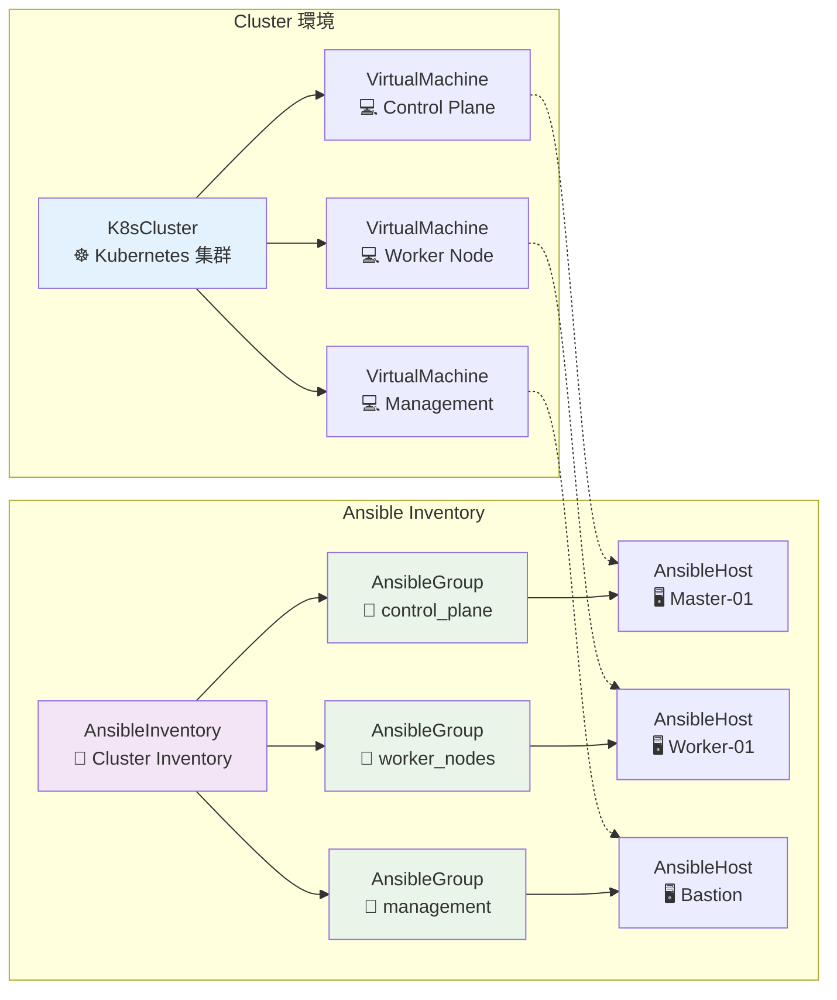

# Ansible Inventory 資料庫架構圖

## 核心架構概覽



## 詳細關聯說明

### 1. Inventory 層級 (最上層)
- **AnsibleInventory**: 管理多個 inventory 文件
- **AnsibleInventoryVariable**: inventory 層級的變數，所有群組和主機都會繼承

### 2. 群組層級 (中間層)
- **AnsibleGroup**: 群組管理，支援層次結構
- **AnsibleGroupVariable**: 群組變數，會覆蓋 inventory 變數
- **AnsibleGroupRelationship**: 父子群組關係，支援變數繼承

### 3. 主機層級 (最下層)
- **AnsibleHost**: 主機管理，支援別名和狀態
- **AnsibleHostVariable**: 主機變數，優先級最高

### 4. 實體資源關聯
- **VirtualMachine** 和 **Baremetal** 透過 Generic Foreign Key 關聯到 **AnsibleHost**
- **K8sCluster** 關聯到 **VirtualMachine**，形成 cluster → VM → AnsibleHost 的鏈路

### 5. 擴展功能
- **AnsibleInventoryPlugin**: 動態 inventory 插件配置
- **AnsibleInventoryTemplate**: 支援生成不同格式的 inventory 文件

## 變數繼承優先級



## 使用流程圖



## Cluster Inventory 特殊流程



## 實際使用場景

### 場景 1: 環境分層管理
```
Production Inventory
├── webservers (群組)
│   ├── web-01 (主機)
│   └── web-02 (主機)
├── databases (群組)
│   ├── db-01 (主機)
│   └── db-02 (主機)
└── monitoring (群組)
    └── monitor-01 (主機)
```

### 場景 2: Cluster 管理
```
K8s Cluster Inventory
├── control_plane (群組)
│   ├── master-01 (主機)
│   └── master-02 (主機)
├── worker_nodes (群組)
│   ├── worker-01 (主機)
│   └── worker-02 (主機)
└── management (群組)
    └── bastion (主機)
```

### 場景 3: 多環境管理
```
Multi-Environment Inventory
├── production (群組)
│   ├── webservers (子群組)
│   └── databases (子群組)
├── staging (群組)
│   ├── webservers (子群組)
│   └── databases (子群組)
└── development (群組)
    ├── webservers (子群組)
    └── databases (子群組)
```

## 關鍵設計原則

1. **層次化結構**: Inventory → Group → Host
2. **變數繼承**: Inventory 變數 → Group 變數 → Host 變數
3. **靈活關聯**: 透過 Generic Foreign Key 支援 VM 和 Baremetal
4. **擴展性**: 支援動態插件和模板系統
5. **狀態管理**: 支援主機和群組的啟用/停用狀態
6. **別名支援**: 主機可以有多個別名

這個架構讓您可以靈活地管理各種複雜的 Ansible inventory 需求，從簡單的單一環境到複雜的多 cluster 多環境管理都能輕鬆應對！
