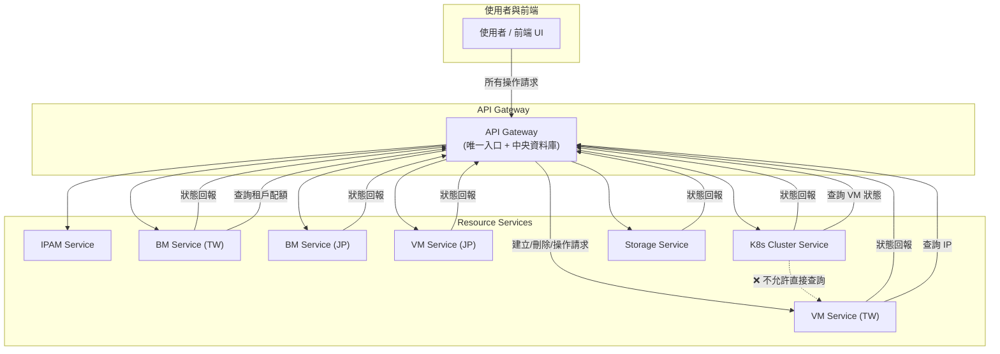

# 私有雲端資源管理平台 - API 系統設計說明文件

---

## 1. 系統定位

本系統為企業內部建置的私有雲端資源管理平台，整合虛擬機部署、實體主機配置、Kubernetes 叢集建立、資源配額控管、維護者制度與租戶分層管理等能力。

API 系統的定位如下：

* **資源操作唯一入口**：所有 VM、BM、K8s、儲存等操作皆透過 API 進入，不直接執行實作，而是調度對應的後端 Service。
* **資料唯一來源**：平台中的帳目資料、狀態、配額等所有資訊，均記錄於 API 系統資料庫，後端與使用者皆透過此系統查詢與寫入。
* **查詢統一中介**：所有跨模組查詢須經由 API 系統，不允許服務間直接互調，避免耦合與不一致性。

---

## 2. 系統目標

1. **資源維運可視化**：即時掌握所有資源狀態與配置，提供完整責任歸屬與調度紀錄。
2. **角色分工清晰**：支援維護者分配、租戶隔離與配額控管，落實組織責任制。
3. **服務解耦**：透過 API 中心化設計，達成模組間資料一致與邊界清晰。
4. **多地部署彈性**：後端服務可根據地理區域獨立部署，支援彈性擴充。
5. **未來導入事件驅動架構**：支援後續升級為事件推送與非同步架構，提升系統反應效率與模組獨立性。

---

## 3. 高階架構總覽

```text
┌──────────┐
│  Portal  │───╮  (GUI / CLI / API )
└──────────┘   │
      │        │
      ▼        │
┌─────────────────────── 資源管理層（Resource Management） ───────────────────────┐
│ BM 管理 │ VM 管理 │ K8s 管理 │ 租戶與配額 │ 主機群組 │ 維護者 │ 記錄與日誌 │
└────────────────────────────────────────────────────────────────────────────┘
                               │
                               ▼
┌───────────────────────── 外部控制器整合層 ─────────────────────────┐
│ VM Provision Controller │ Bare-metal Controller │ IPAM │ Network Controller │ Storage Controller │
└────────────────────────────────────────────────────────────────────┘
                               │
                               ▼
┌─────────────────────── 基礎設施層（Data Center Layer） ───────────────────────┐
│ 機房/機櫃 │ BMC │ Switch │ Ceph │ NFS │ SAN │ GPU │
└────────────────────────────────────────────────────────────────────────────┘
```

---

## 4. 功能說明
1. **資源管理**：管理實體機（Baremetal）、虛擬機（VirtualMachine）、Kubernetes 叢集（K8sCluster）及相關網路與周邊資源。
2. **維護管理**：可指派「個人維護者 (Maintainer)」或「維護者群組 (MaintainerGroup)」負責管理各種資源，並掌握資源所有者或維護者。
3. **多維度分組**：支援「機架 (Rack)」與「實體機群組 (BaremetalGroup)」的概念，可依據地理位置、負載狀況等不同條件，將實體機進行彈性分組。
4. **租戶與配額**：可為不同租戶 (Tenant) 設定在某一資源群組內的配額限制（CPU、記憶體、儲存空間等）。
5. **K8s 叢集管理**：提供 Kubernetes 叢集的建立與管理，包括外掛 (Plugins)、Service Mesh、與堡壘機 (Bastion) 之關聯設定。
6. **自動化調度**：在建立虛擬機或叢集資源時，系統會根據租戶配額、群組可用量、實體機可用量等進行自動化調度與分配。

---

## 5. API 系統架構

### 5.1 API Gateway（唯一入口 + 中央資料庫）

* 提供統一入口給所有操作請求。
* **內含中央資料庫**，是所有資源（VM、BM、K8s Cluster、Storage、IP Pool、Quota 等）的唯一真實來源（source of truth）。
* 根據需求自動路由請求至對應 Service。
* 接收後端回報並更新資源狀態。
* 提供標準化查詢、審計、版本控管、權限驗證等功能。
* 收到請求後，流程如下：

  1. 驗證請求是否合法與權限。
  2. **寫入 / 更新自己的資料庫**（如：VM status = `provisioning`）。
  3. 根據目標區域與資源類型，**轉發請求至對應後端 Service**。
  4. 後端服務處理完成後，**反向回報狀態給 API Gateway，更新資料庫**。

### 5.2 後端 Resource Services（可分區部署、僅負責實作）

| Service 名稱              | 功能說明                                                              |
| ----------------------- | ----------------------------------------------------------------- |
| **IPAM Service**        | 負責 IP address 資源的分配與釋放，包含 subnet 規劃、IP 保留、釋放、避免重複。                |
| **BM Service**          | 實體主機（Baremetal）管理與維護，例如主機狀態同步、維修標記、健康檢查等。                         |
| **VM Service**          | 負責建立/關機/刪除虛擬機（VirtualMachine），根據資源配額與配置進行部署。                      |
| **K8s Cluster Service** | 建立 Kubernetes 叢集（control-plane + worker），處理網路外掛、Service Mesh、升級等。 |
| **Storage Service**     | 提供磁碟、Volume 類型資源的建立與回收，例如 VM disk、K8s PVC 支援等。   

* 每個 Service 在不同地理區域皆可獨立部署（ex: `vm-service.tw`, `vm-service.jp`）。
* 各服務**不保留自己完整的資源資料**，所有狀態查詢與更新皆透過 API Gateway 處理。

---

## 6. 微服務間通訊與查詢原則

### 🔁 資料存取方式

* 所有服務在需要查詢其他資源狀態時（如 VM 狀態、租戶配額），**必須透過 API Gateway 查詢中央資料庫**。
* 禁止模組之間直接呼叫對方 Service，避免耦合與介面變動風險。

### 📌 原則摘要

| 原則                 | 說明                                                          |
| ------------------ | ----------------------------------------------------------- |
| ❌ 禁止直接查詢其他 Service | 例如：Cluster Service 不得直接呼叫 VM Service 來查 VM 狀態。              |
| ✅ 資料一致性來源統一        | 所有查詢一律從 API Gateway 的資料庫查取，避免多版本不一致。                        |
| ✅ 降低耦合與維護風險        | 若 VM Service API 格式改變，不會影響 Cluster Service；只需更新 Gateway 介面。 |
| ✅ 採用穩定標準化介面        | API Gateway 提供統一、版本控管的查詢 API，利於向前相容與轉接改版。                   |
| ✅ 增強權限控管與日誌稽核      | Gateway 能紀錄每筆跨服務查詢、限制權限與可見範圍。      
---

## 7. 架構示意圖

```plaintext
K8s Cluster Service ────▶ API Gateway ────▶ VM 狀態查詢（中央資料庫）
```

```plaintext
                    ┌────────────────────┐
                    │    使用者 / UI     │
                    └────────┬───────────┘
                             │
                             ▼
                    ┌────────────────────┐
                    │     API Gateway     │◄────────────────────────┐
                    │ (中央資料庫 + API) │                         │
                    └────┬────────────────┘                         │
                         │新增/更新資源狀態                         │後端完成後狀態回報
                         ▼                                         │
                ┌─────────────────────────────────────┐           │
                │ 根據服務類型與地區自動轉發 API 請求 │           │
                └─────────────────────────────────────┘           │
                         │
 ┌──────────────────────┼────────────────────────────────────────────────────┐
 ▼                      ▼                      ▼                      ▼      ▼
IPAM Service     BM Service (TW)        VM Service (JP)      K8s Cluster    Storage
(中央服務或區域)    BM Service (JP)        VM Service (TW)      Service         Service
                                       ...                    (TW/JP/...)     (TW/JP/...)

             ▲                       ▲                        ▲               ▲
             │        ←←←←←←←←←←←←←←←┘                        │               │
             │     回報：狀態、實際分配、IP、節點等資料         │               │
             └────────────────────────────────────────────────────────────────┘

                    （所有狀態一致性與資料更新皆經由 API Gateway）
```



---

## 8. 架構優劣比較（含替代方案）

### 模式比較：API Gateway 作為協調者 vs 各 Service 直接通訊

| 項目     | Gateway 協調模式 | Service 互調模式 |
| ------ | ------------ | ------------ |
| 模組耦合   | ✅ 解耦         | ❌ 高耦合        |
| 介面穩定性  | ✅ 統一管理       | ❌ 改版牽連廣      |
| 資料一致性  | ✅ 單一資料源      | ❌ 分散風險高      |
| 權限管理   | ✅ 集中控管       | ❌ 各自實作       |
| 審計能力   | ✅ 全紀錄        | ❌ 難整合        |
| 初期建置速度 | ⚠️ 較慢        | ✅ 快速         |
| 長期維護負擔 | ✅ 可控         | ❌ 高風險        |
| 擴充與測試  | ✅ 模組獨立       | ❌ 測試困難       |

---

## 9. 導入事件驅動架構的評估

本系統目前以同步 API 為主。未來導入事件驅動可帶來以下優勢：

| 面向   | 評估結果                           |
| ---- | ------------------------------ |
| 遷移成本 | ✅ 可逐步導入（如先從狀態通知事件開始）           |
| 擴充性  | ✅ 增加異步彈性與服務間反應速度               |
| 建議方向 | 建議於第二階段納入，如部署完成 → 發送事件，由其他服務訂閱 |

初期可維持同步控制模型，待模組穩定後引入 Kafka / RabbitMQ 等機制，以事件為核心驅動後端狀態處理與觀測。

---

## 10. 結語與推薦路線

本設計已對齊公有雲實務標準，具備高一致性、強解耦性與可觀測性，適合作為私有雲平台的 API 中樞架構。之後第二階段可持續優化以下方向：

* 強化 API Gateway 高可用性與快取能力
* 建立標準 API Schema 與版本治理
* 為第二階段規劃事件驅動模組與事件介面格式
* 逐步擴充服務模組與資源覆蓋範圍

